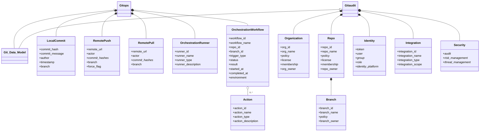

```mermaid
classDiagram
    %% ========= TOP DOMAINS =========
    class Gitops
    class Gitaudit
    Gitops <|-- Git_Data_Model
    Gitaudit <|-- Git_Data_Model

    %% ========= GITOPS =========
    class LocalCommit {
        +commit_hash
        +commit_message
        +author
        +timestamp
        +branch
    }
    class RemotePush {
        +remote_url
        +actor
        +commit_hashes*
        +branch
        +force_flag
    }
    class RemotePull {
        +remote_url
        +actor
        +commit_hashes*
        +branch
    }
    class OrchestrationRunner {
        +runner_id
        +runner_name
        +runner_type
        +runner_description
    }
    class OrchestrationWorkflow {
        +workflow_id
        +workflow_name
        +repo_id
        +branch_id
        +trigger_type
        +status
        +result
        +started_at
        +completed_at
        +environment
    }
    Gitops *-- LocalCommit
    Gitops *-- RemotePush
    Gitops *-- RemotePull
    Gitops *-- OrchestrationRunner
    Gitops *-- OrchestrationWorkflow
    OrchestrationWorkflow o-- "0..*" Action

    class Action {
        +action_id
        +action_name
        +action_type
        +action_description
    }

    %% ========= GITAUDIT =========
    class Organization {
        +org_id
        +org_name
        +policy*
        +license
        +membership*
        +org_owner
    }
    class Repo {
        +repo_id
        +repo_name
        +policy*
        +license
        +membership*
        +repo_owner
    }
    class Branch {
        +branch_id
        +branch_name
        +policy*
        +branch_owner
    }

    class Identity {
        +token*
        +user*
        +group*
        +role*
        +identity_platform*
    }

    class Integration {
        +integration_id
        +integration_name
        +integration_type
        +integration_scope
    }

    class Security {
        +audit*
        +risk_management*
        +threat_management*
    }

    Gitaudit *-- Organization
    Gitaudit *-- Repo
    Repo *-- Branch
    Gitaudit *-- Identity
    Gitaudit *-- Integration
    Gitaudit *-- Security

```
