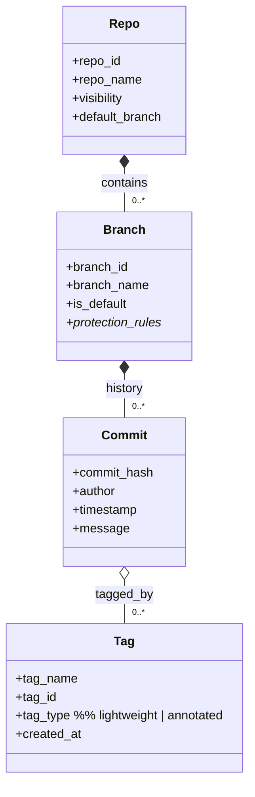

# Guidelines for the Project

### Contributing

```mermaid
classDiagram
    %% === ENTITIES ===
    class Repo {
        +repo_id
        +repo_name
        +visibility
        +default_branch
    }

    class Branch {
        +branch_id
        +branch_name
        +is_default
        +protection_rules*
    }

    class Commit {
        +commit_hash
        +author
        +timestamp
        +message
    }

    class Tag {
        +tag_name
        +tag_id
        +tag_type   %% lightweight | annotated
        +created_at
    }

    %% === RELATIONSHIPS ===
    Repo   *--  "0..*" Branch  : contains
    Branch *--  "0..*" Commit  : history
    Commit o--  "0..*" Tag     : tagged_by
```
